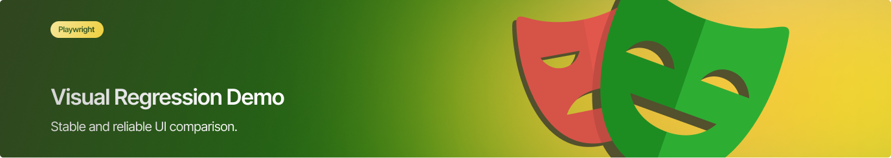
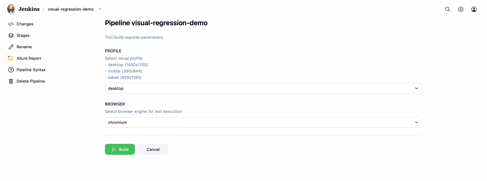
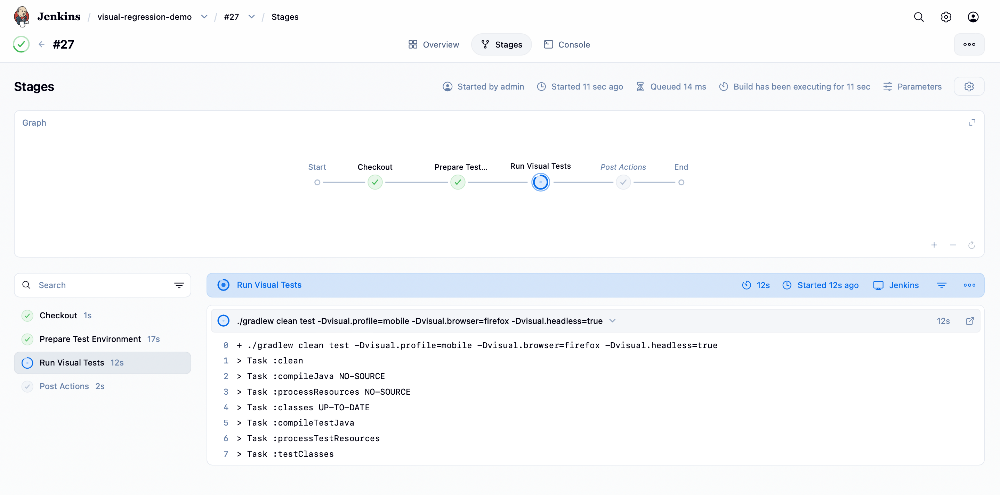
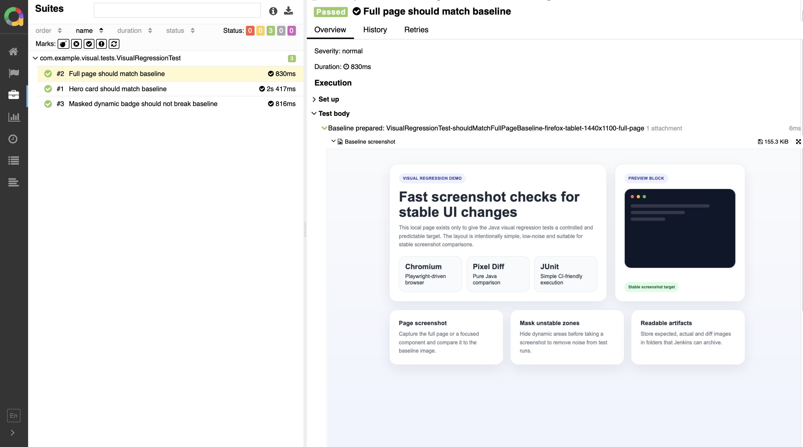
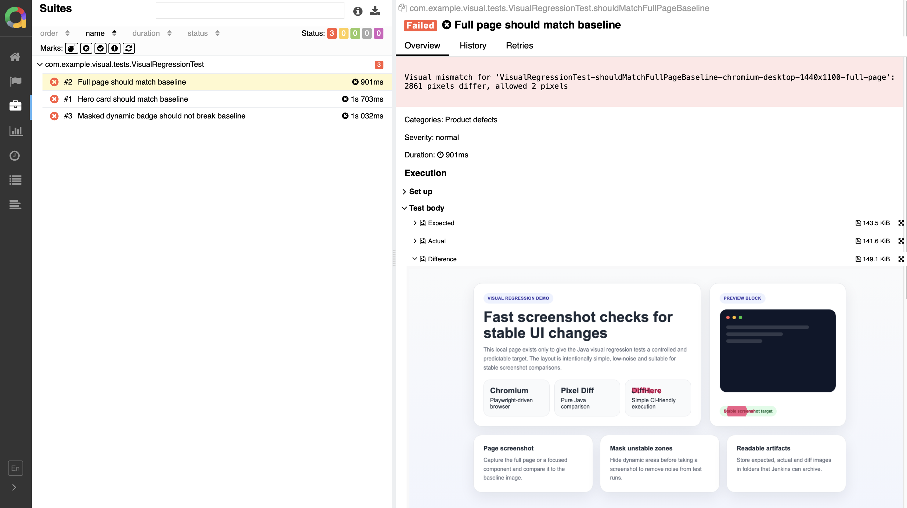

# Visual Regression Demo — Automated UI Snapshot Testing & CI Integration

This project demonstrates a **Java-based visual regression testing framework** using Playwright, focused on **UI consistency validation**, **snapshot comparison**, and **CI execution with configurable parameters**.

<p align="center">
  
</p>

---

## Table of Contents

* [Tools](#tools)
* [What This Project Demonstrates](#what-this-project-demonstrates)
* [Test Execution Flow](#test-execution-flow)
* [Running Tests Locally](#running-tests-locally)
* [Running in Jenkins (CI)](#running-in-jenkins-ci)
* [Visual Comparison Results](#visual-comparison-results)

---

## Tools

<p align="center">
  
  
  
  
  
  
</p>

---

## Test Execution Flow

1. Open target page using Playwright
2. Apply configured viewport (screen resolution)
3. Capture screenshot (actual)
4. Load baseline image
5. Compare images pixel-by-pixel
6. Generate diff (if mismatch exists)
7. Attach results to Allure report
8. Fail test if threshold exceeded

---

## Running Tests Locally

Run tests with default configuration:

```bash
./gradlew clean test
```

Run with custom parameters:

```bash
./gradlew clean test \
  -Dvisual.browser=chromium \
  -Dvisual.profile=desktop
```

### Available parameters:

* `visual.browser`
    * chromium
    * firefox
  
* `visual.profile` (screen resolutions)
    * desktop
    * tablet
    * mobile

---

## Running in Jenkins (CI)

This project supports **fully parameterized execution in Jenkins**.

### Pipeline parameters

* **BROWSER** → selects browser (chromium / firefox)
* **PROFILE** → selects viewport size

---

### Jenkins Job Configuration

<p align="center">
  
</p>

* Parameters are defined in Jenkins UI
* User selects browser + viewport before execution

---

### Pipeline Execution

```bash
./gradlew clean test \
  -Dvisual.browser=${params.BROWSER} \
  -Dvisual.profile=${params.PROFILE}
```

---

### Jenkins Pipeline Run

<p align="center">
  
</p>

* Build is triggered with selected parameters
* Tests run in selected browser
* Screenshots are generated during execution

---

### Test Results (Allure Report)

<p align="center">
  
</p>

* Each test contains visual attachments
* Easy navigation between test results

---

### Visual Attachments in Allure

<p align="center">
  
</p>

Each failed test includes:

* Baseline image
* Actual screenshot
* Diff image (highlighted differences)