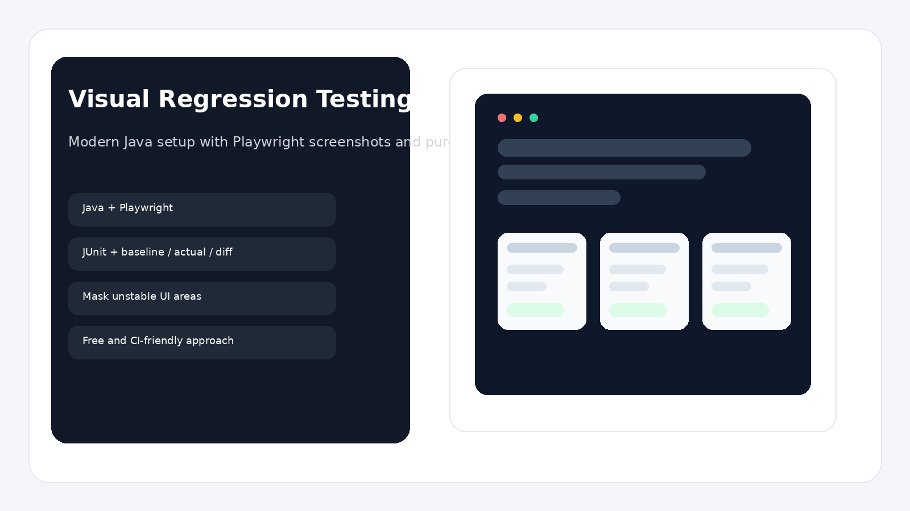
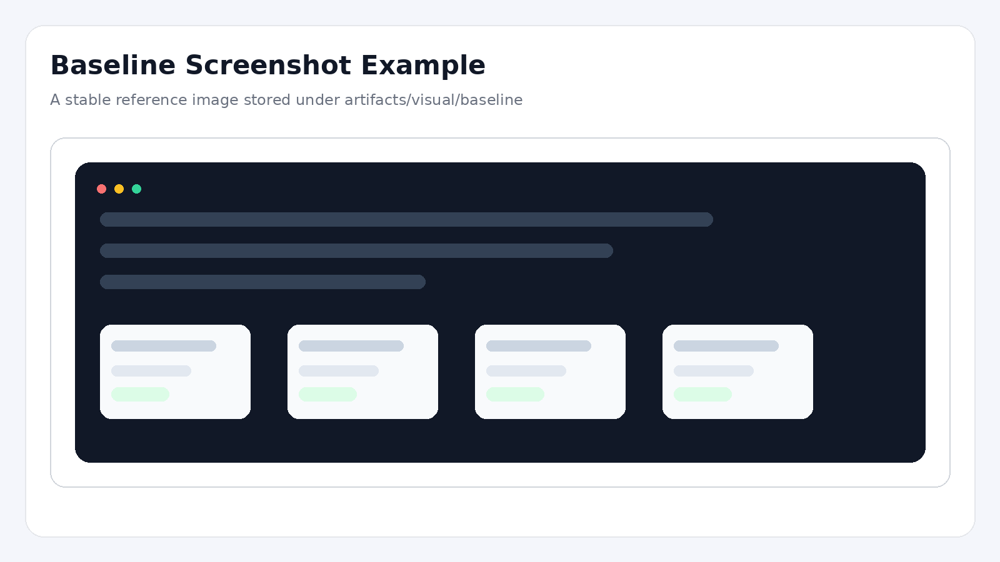
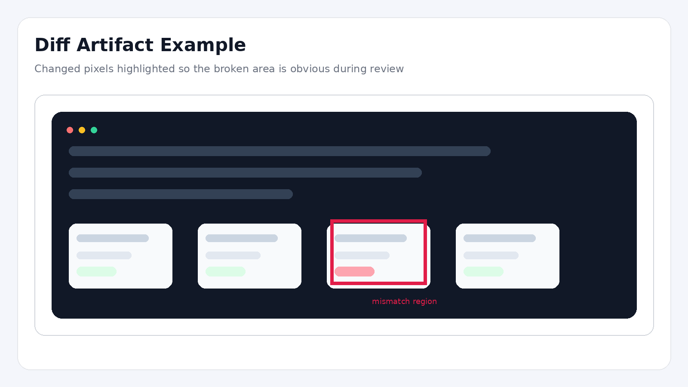

# Visual Regression Testing Demo — Java + Playwright + Allure

A small Java-based automation project that demonstrates **visual regression testing** with **Playwright for Java**, **JUnit**, **Allure reporting**, and a **pure Java image diff** approach.

The idea is simple:
- open a page
- take a screenshot
- compare it with the baseline
- save **actual** and **diff** artifacts when something changes
- attach everything to **Allure** and archive it in **CI**

This project is intentionally built around a **free** approach: no paid SaaS, no vendor lock-in, and no external visual platform required.

---

## Content

- Tools
- What This Project Demonstrates
- Project Preview
- How It Works
- Running Tests Locally
- Allure Report
- Jenkins Pipeline
- Project Structure
- Ways to Improve It
- Example Screenshots

---

## Tools

<p align="left">
  
  
  
  
  
  
  
</p>

---

## What This Project Demonstrates

- visual regression testing in a Java project
- screenshot comparison without paid services
- baseline / actual / diff artifact flow
- deterministic UI testing against a local demo page
- masking unstable elements before screenshot comparison
- Allure attachments for actual / baseline / diff images
- Jenkins-ready pipeline with artifact archiving
- cleaner test structure with page objects and reusable visual assertion helpers

---

## Project Preview

<p align="left">
  
</p>

> This repository includes a small static demo page under `src/test/resources/demo-page` so that the tests have a stable visual target from day one.

---

## How It Works

### 1. Full page visual check
The test opens the page and captures a full-page screenshot.

### 2. Component-level visual check
The test captures only a specific block, so you can validate a widget or section instead of the whole page.

### 3. Masking dynamic UI
A dynamic element is changed during the test, then masked before taking the screenshot. This removes noise from timestamps, counters, rotating banners, and similar unstable content.

### 4. Artifact generation
For each snapshot name, the framework stores images in:

```text
artifacts/
  visual/
    baseline/
    actual/
    diff/
```

### 5. Allure evidence
Each run attaches:
- actual screenshot
- baseline screenshot
- diff screenshot
- text summary with mismatch percentage

---

## Running Tests Locally

### Requirements
- Java 17
- Gradle 9.4.1+

### 1. Install Playwright browser
```bash
gradle installBrowsers
```

### 2. Run tests
```bash
gradle clean test
```

### 3. Generate Allure report
```bash
gradle allureReport
```

### 4. Open generated artifacts
After execution, check:

```text
artifacts/visual/baseline
artifacts/visual/actual
artifacts/visual/diff
build/reports/allure-report
```

---

## Allure Report

This version already includes Allure integration.

The visual assertion layer attaches:
- actual image
- baseline image
- diff image
- mismatch summary

That makes the failure much easier to review than a plain assertion error in console logs.

---

## Jenkins Pipeline

A ready-to-use `Jenkinsfile` is included.

It does the following:
- checkout source code
- verify Java
- install Playwright Chromium
- run visual tests
- generate Allure report
- archive visual artifacts
- publish JUnit results
- publish Allure results

This is useful for a portfolio project because you can show both the **test execution** and the **reporting flow** in one CI pipeline.

---

## Ways to Improve It

### 1. Add viewport profiles
Keep separate baselines for desktop, tablet, and mobile.

### 2. Add multi-browser mode
Run the same checks in Chromium, Firefox, and WebKit.

### 3. Add per-feature baseline folders
Instead of storing all snapshots in one folder, split them by feature or page.

### 4. Add approval flow
Store changed screenshots as CI artifacts and review them before promoting them to baseline.

### 5. Add ignore zones helper
Centralize masks for clocks, banners, carousels, counters, and ads.

### 6. Add real application target
Replace the demo page with a real UI or a demo app that better matches your portfolio.

### 7. Add baseline versioning strategy
For example, keep branch-based or environment-based baselines.

### 8. Add cross-resolution support
Use snapshot naming that includes viewport and browser.

---

## Example Screenshots

### Baseline style
<p align="left">
  
</p>

### Diff style
<p align="left">
  
</p>


---

## Notes

- Playwright for Java is used for browser automation and screenshot capture.
- The screenshot comparison logic stays free and customizable because it is implemented in Java.
- Allure is already wired in, so each failed visual check can include useful evidence instead of only console logs.
